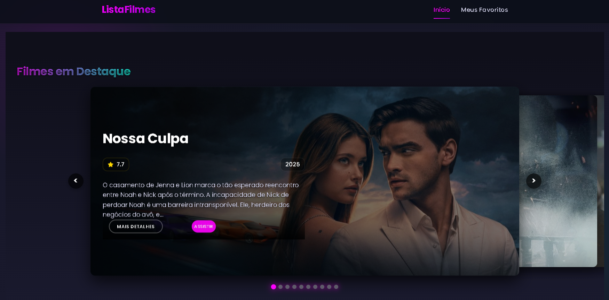
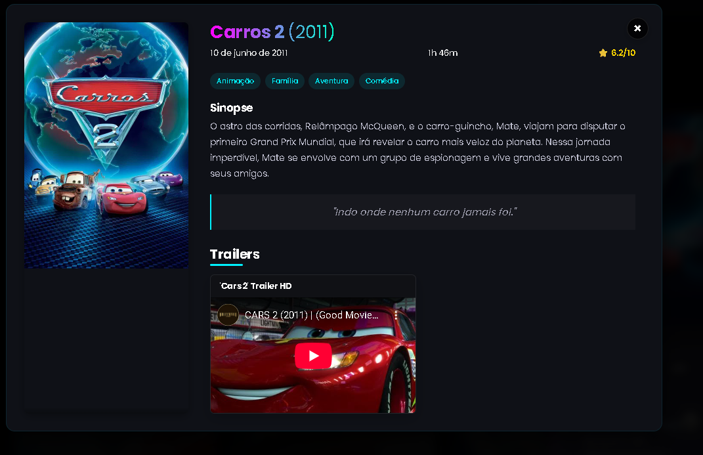
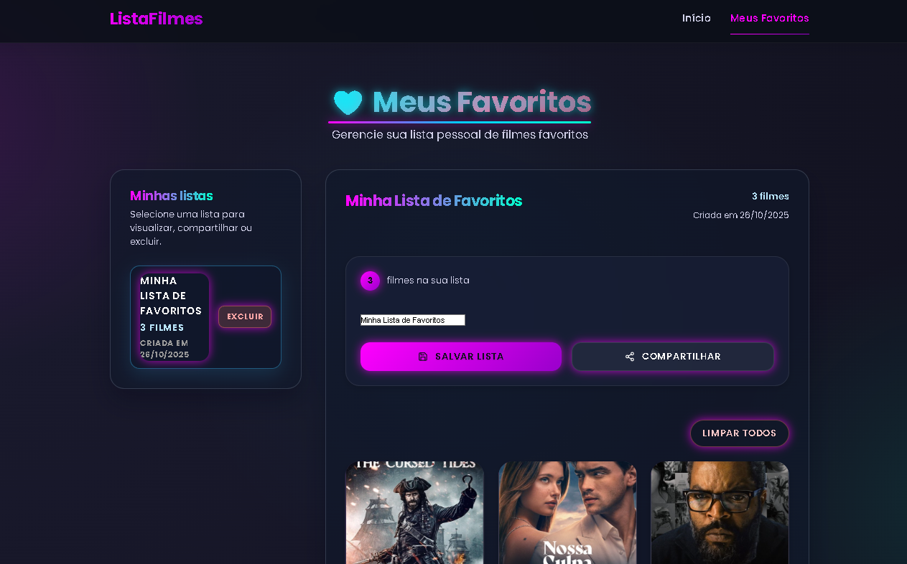

<div align="center">
  <h1>🎬 Movie Favorites Manager</h1>
  
  [](https://github.com/pramozdev/filmes01/blob/main/LICENSE)
  [](https://github.com/pramozdev/filmes01/commits/main)
  [](https://github.com/pramozdev/filmes01/stargazers)
  [](https://github.com/pramozdev/filmes01/network/members)
  
  [](https://vitejs.dev/)
  [](https://reactjs.org/)
  [](https://www.djangoproject.com/)
  [](https://www.django-rest-framework.org/)
  
  [](https://pramozdev.github.io/listafilmes)
</div>

---

Aplicação full stack para pesquisar filmes na TMDb, assistir trailers do YouTube, montar múltiplas listas de favoritos e compartilhá-las. O frontend foi construído com React + Vite e o backend com Django + Django REST Framework.

## 🧭 Visão Geral

- **Frontend**: React 18, React Router, Axios e CSS modular com tema futurista/responsivo.
- **Backend**: Django 4.2 + DRF, banco SQLite, UUID para listas e JSONField para filmes.
- **Integração**: API TMDb para catálogo e endpoints próprios para persistência/compartilhamento de listas.

## 🎯 Principais Funcionalidades

### Interface Web
- Buscar filmes na TMDb com resultados ricos (poster, nota, sinopse).
- Assistir trailers diretamente do YouTube quando disponíveis.
- Visualizar múltiplos trailers e alternar entre eles.
- Favoritar/desfavoritar com feedback imediato e persistência local.
- Salvar listas nomeadas no backend, gerar link e copiar automaticamente.
- Exibir todas as listas salvas, selecionar uma para visualização e excluir quando desejado.
- Página dedicada a listas compartilhadas via link público.

### API Backend
- Endpoints REST para criar, listar, detalhar e excluir listas de favoritos.
- Respostas normalizadas com UUID, nome, timestamp, filmes e URL de compartilhamento.
- Tratamento de erros com mensagens claras para o frontend.

## 📸 Capturas de Tela

<div align="center">
  
  
  
  
</div>

## 🚀 Como Executar Localmente

### Pré-requisitos
- Node.js 18+
- Python 3.11+
- (Opcional) Ambiente virtual para o backend

### 1. Backend (Django)
```bash
cd backend
python -m venv venv  # opcional
venv\Scripts\activate  # Windows
pip install -r requirements.txt
cp .env.example .env  # ou copie manualmente e informe a DJANGO_SECRET_KEY
python manage.py migrate
python manage.py runserver 9000
```
O backend sobe em `http://localhost:9000`.

### 2. Frontend (React + Vite)
```bash
cd frontend
npm install
npm run lint  # conferindo lint
npm run dev
```
O frontend roda em `http://localhost:5173`.

### 3. Scripts Rápidos (Windows)
- `start-backend.bat` inicia o servidor Django.
- `start-frontend.bat` inicia o Vite.

## 🔑 Configuração de APIs

### TMDb
1. Crie uma chave da API em [https://www.themoviedb.org/settings/api](https://www.themoviedb.org/settings/api).
2. Copie `frontend/env.example` para `frontend/.env`.
3. Defina `VITE_TMDB_API_KEY=<sua_chave>`.

### YouTube Data API v3 (Opcional para trailers)
1. Acesse o [Google Cloud Console](https://console.cloud.google.com/)
2. Crie um novo projeto ou selecione um existente
3. Ative a API do YouTube Data API v3
4. Crie uma chave de API
5. Adicione ao seu `.env`:
   ```
   VITE_YOUTUBE_API_KEY=<sua_chave_do_youtube>
   ```

> **Nota:** Sem a chave da TMDb, as requisições serão bloqueadas. Sem a chave do YouTube, apenas os trailers disponíveis diretamente da TMDb serão exibidos.

## ☁️ Publicar em Produção

Para instruções detalhadas de como fazer o deploy da aplicação em produção, consulte o guia completo em [DEPLOY.md](DEPLOY.md).

### Visão Geral do Deploy
- **Frontend**: Pode ser hospedado em serviços como Vercel, Netlify ou Render
- **Backend**: Requer um servidor com suporte a Python/Django (Render, Railway, Heroku, etc.)
- **Banco de Dados**: Recomendado PostgreSQL para produção

### Variáveis de Ambiente Necessárias
- `VITE_TMDB_API_KEY` (Frontend)
- `VITE_API_BASE_URL` (Frontend - apontando para o backend em produção)
- `DJANGO_SECRET_KEY` (Backend)
- `DATABASE_URL` (Backend - string de conexão com o banco de dados)

## 🔗 Endpoints Principais

| Método | Rota                | Descrição                                 |
|--------|---------------------|--------------------------------------------|
| POST   | `/api/save/`        | Salva uma nova lista de favoritos e retorna a lista completa, incluindo link de compartilhamento |
| GET    | `/api/lists/`       | Retorna todas as listas salvas ordenadas do mais recente ao antigo |
| GET    | `/api/<uuid>/`      | Detalha uma lista específica |
| DELETE | `/api/<uuid>/`      | Remove uma lista e retorna mensagem de sucesso |
| GET    | `/api/shared/<id>/` | Recupera uma lista pública via link compartilhável |

## 📁 Estrutura Simplificada

```
projeto002/
├── backend/
│   ├── movie_api/
│   │   ├── models.py
│   │   ├── serializers.py
│   │   ├── views.py
│   │   └── urls.py
│   ├── movie_project/
│   │   ├── settings.py
│   │   └── urls.py
│   └── manage.py
├── frontend/
│   ├── src/
│   │   ├── components/
│   │   ├── pages/
│   │   ├── services/
│   │   └── styles/
│   └── vite.config.js
├── INSTRUÇÕES.md
└── README.md
```

## 🔗 Endpoints Principais

| Método | Rota                | Descrição                                 |
|--------|---------------------|--------------------------------------------|
| POST   | `/api/save/`        | Salva uma nova lista de favoritos e retorna a lista completa, incluindo link de compartilhamento |
| GET    | `/api/lists/`       | Retorna todas as listas salvas ordenadas do mais recente ao antigo |
| GET    | `/api/<uuid>/`      | Detalha uma lista específica |
| DELETE | `/api/<uuid>/`      | Remove uma lista e retorna mensagem de sucesso |
| GET    | `/api/shared/<id>/` | Recupera uma lista pública via link compartilhável |
- [x] Favoritar/desfavoritar filmes
- [x] Salvar lista nomeada e gerar link compartilhável
- [x] Gerenciar múltiplas listas (selecionar, visualizar, excluir)
- [x] Página pública para listas compartilhadas
- [x] Persistência local + sincronização com backend
- [x] UI responsiva com tema futuro/glassmorphism

## 🧪 Testes & Ferramentas

- `test-api.py` fornece um script opcional para validar o fluxo de salvar/compartilhar via linha de comando.
- Recomenda-se testar manualmente a exclusão/seleção de listas após alterações.

---


